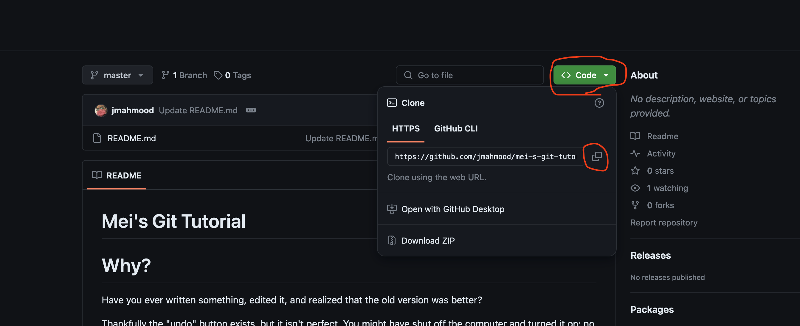

# Mei's Git Tutorial

# Why?

Have you ever written something, edited it, and realized that the old version was better? 

Thankfully the "undo" button exists, but it isn't perfect.  You might have shut off the computer and turned it on; no undo function would be available.

Microsoft Word has a "Version History" feature that lets you view and load older versions of your saved document.  This is even better.  

However, what if you are experimenting and want to try different ideas out?  You can try things like having multiple files, but this gets hard to manage.  

This gets much worse when you try to write something with a friend.[1] You might decide to take the story in one direction, while your friend chooses another. How are you going to merge these two versions of the story together?  

In the IT world, we use a program called "git" to handle problems like this.  

Git is a "Version Control System" and is used to help people keep track of changes to a system.  It can help you see old version of your document, and allow you to try out new things on different versions without modifying your main version (the "Master branch") of your work.

You can use Linux on nearly any system available today; Windows, MacOS, Linux, and BSD all have versions that you can use.  

Our job is going to be learn git - today.


# なぜ？

何かを書いて、編集して、古いバージョンの方が良かったと気づいたことはありますか？

幸いにも「元に戻す」ボタンがありますが、完璧ではありません。コンピュータをシャットダウンして再起動した場合、その「元に戻す」機能が使えないかもしれません。

まだ諦めちゃだめ。Microsoft Wordを使っているなら「バージョン履歴」という機能があり、保存された文書の古いバージョンを表示して読み込むことができます。うえぃ、元に戻されました！

しかし、もし実験的に異なるアイデアを試したい場合はどうでしょうか？複数のファイルを使ってみる方法がありますが、そうすれば管理が難しくなる。

友人と何かを書くとき、さらに問題は悪化します。[1] あなたは物語を一方向に進めるかもしれませんが、友人は別の方向を選ぶかもしれません。これら二つのバージョンの物語をどうやって一つに統合しますか？

職場では、このような問題を解決するために「git」というプログラムを使用します。

Gitはバージョン管理システムの一つで、システムに加えられた変更を追跡するのに役立ちます。このシステムを使うと、文書の古いバージョンを確認したり、メインバージョン（マスターブランチと呼ばれる）を変更せずに新しいアイデアを異なるバージョンで試すことができます。

gitはWindows、MacOS、Linux、BSDに対応したバージョンがあるから、君はすぐ対応できます。

これでgitが何かがわかったので、次はその使い方を学びましょう。


[1] Communicating with a lot of people is a very hard problem.  There is an unrelated classic book about this called "The Mythical Man-Month" that was written in 1975.  While it does not deal directly with version control, you might find it helpful to read when you decide to manage projects.


# Install git NOW

I assume you are on Windows.  This will require some extra work to use for work, but it's fine for when you are starting out.  One day you may decide to graduate to a Linux system which will – ironically – make the process easier.

Microsoft offers a step-by-step tutorial to [install Windows Subsystem for Linux](https://learn.microsoft.com/en-us/windows/wsl/install).  This is a must.  WSL2 is used by nearly everyone; only highly experienced grey beards (experienced older developers) and developers with very specific circumstances do not use WSL2.

Next you are going to have to install your development environment tools.  Again, Microsoft [has a tutorial for you](https://learn.microsoft.com/en-us/windows/wsl/setup/environment).  This will install Ubuntu which is fine.  Ignore the part about other distributions for now.

A few notes about the instructions:

- It is also going to ask you to install a "code editor"; for the time being, use the free Visual Studio Code.  In the future, you are going to learn about the many options you have [2].  
- Docker is also mentioned; install it. It’s not immediately necessary, but it will be beneficial later.
- You don't have to worry about databases yet, or about GPU acceleration.  
- You should learn the WSL commmands, but we will discuss those later.

Finally, you can install Git using the [tutorial here](https://learn.microsoft.com/en-us/windows/wsl/tutorials/wsl-git).  You can ignore anything that suggests you make a Github account; Microsoft owns Github now (so of course they would tell you to get an account).  You also can ignore the part about Git Credential Manager, it has nothing to do with your work for now.


# gitをインストールせよ！


Windowsを使用していると思います。仕事に使用する際に少し手間がかかりますが、初心者として大丈夫です。　いつかWindowsを卒業し、MacやLinuxを利用するとプロセスがより簡単になります。

MicrosoftはWindows Subsystem for Linux（WSL）をインストールするためのステップバイステップのチュートリアルを[提供しています](https://learn.microsoft.com/ja-jp/windows/wsl/install)。  これは必須です。ほとんどの開発者はWSL2を使用します。(非常に経験豊富な古参の開発者（グレイビアード）や特定の状況にある開発者は例外です)。

次に、開発環境ツールをインストールする必要があります。ここでもMicrosoftが[チュートリアルを提供しています](https://learn.microsoft.com/ja-jp/windows/wsl/setup/environment)。これによりUbuntuがインストールされますが、今は他のディストリビューションについては考えなくても大丈夫です。

指示についてのいくつかの注記：

-コードエディタのインストールを求められますが、当面は無料のVisual Studio Codeを使用してください。将来的にはさまざまな選択肢があることを学びます。[2]
- Dockerについても言及されていますが、インストールしてください。すぐに必要というわけではありませんが、後で役立ちます。
- まだデータベースやGPUアクセラレーションについて心配する必要はありません。
- WSLコマンドについては学ぶ必要がありますが、それについては後で詳しく説明します。

最後に、[こちらのチュートリアル](https://learn.microsoft.com/en-us/windows/wsl/tutorials/wsl-git)を使用してGitをインストールできます。GitHubアカウントを作成するように提案されても無視してください。 (MicrosoftがGitHubを所有しているため、アカウントを取得するように勧めるのは当然のことです。)また、Git Credential Managerについても、今のところあなたの仕事には関係ないので無視してください。

[2] If someone ever suggests you should install Eclipse, nod politely; however please note that the suggestions makes them untrustworthy.　もし誰かがEclipseのインストールを勧めたら、礼儀正しく反応してください。しかし、その提案をする人は信頼できないことを覚えておいてください。


# My First Git

There are many common myths about Git. It is not only for programming, and you do not need an account on any service; you can use Git on your own computer.

Let's start by creating a text file. You can do this using Notepad or tools such as Notepad++ or Sublime Text.[3]

Let's save it to a new directory inside of the Documents directory. When saving, you need to create a new directory. Let's call that directory "MeiProject1". Create a file inside called "test.txt", and put in the following text.

```
Hello World: Version 1
```

You can now save it.

Now that you have saved the file, you need to go to the directory.

From the Windows Menu, select "WSL" or "Ubuntu" (or whatever your WSL distribution is named). If you don't see it, type it in the search bar.

When the WSL terminal opens, you need to navigate to the directory where you saved your file. You can do this using the `cd` command, which stands for "change directory."

First, navigate to the Windows file system. Typically, your Windows files are located in `/mnt/c/Users/<YourUsername>/Documents`. You can replace `<YourUsername>` with your actual Windows username. For example:

```sh
cd /mnt/c/Users/<YourUsername>/Documents/MeiProject1
```

This command will change your current directory to the "MeiProject1" directory inside your "Documents" folder.

Now that you are in the correct directory, we need to initialize a Git repository.

### What is a Git Repository?

Think of a Git repository like a special notebook where you keep track of all the changes to your documents. Just like you might use different sections of a notebook to write drafts and final versions of a story, a Git repository helps you keep track of different versions of your files. You can think of the initial setup as creating a new, empty notebook.

To initialize (or set up) a new Git repository, type the following command:

```sh
git init
```

This command will create an empty Git repository in the "MeiProject1" directory. It's like opening a new notebook where you can start recording changes to your files.

### Staging and Committing Files

Next, let's add your text file to the repository. Type the following command:

```sh
git add test.txt
```

Adding a file to the repository using `git add` stages the file. Staging is like putting a sticky note on the page of your notebook to mark it for future reference. The file is now ready to be committed.

Committing is like writing an entry in the table of contents of your notebook, noting what changes were made and when. This way, you can easily find and refer back to specific changes later.

To save the current state of your files in the repository, you need to commit them. Type the following command:

```sh
git commit -m "Initial commit with test.txt"
```

The `-m` flag allows you to include a message with your commit. This message should describe what changes are included in this commit. Here, we’ve used "Initial commit with test.txt" as our message.

### Branches

Now, let's create a new branch. Branches in Git allow you to work on different versions of a project simultaneously. Think of a branch as a separate section of your notebook where you can experiment with new ideas without changing the original story. Type the following command to create a new branch called "new-feature":

```sh
git branch new-feature
```

To switch to this new branch, type the following command:

```sh
git checkout new-feature
```

Now you are on the "new-feature" branch. Let's make a change to the `test.txt` file. Open `test.txt` in your text editor, change the text to the following, and save it:

```
Hello World: Version 2
```

After saving the file, add and commit the change:

```sh
git add test.txt
git commit -m "Updated to Version 2"
```

Now let's switch back to the main branch to see the difference. Type the following command to switch back to the main branch:

```sh
git checkout main
```

To see the difference between the versions of the `test.txt` file in the "main" and "new-feature" branches, use the following command:

```sh
git diff new-feature test.txt
```

This command will show you the differences between the `test.txt` file in the "new-feature" branch and the `test.txt` file in the current branch (which is "main"). It's like comparing the drafts of your story in different sections of your notebook.

Congratulations! You have successfully:

- Created a Git repository.
- Added files using `git add`.
- Committed files using `git commit`.
- Created a branch using `git branch`.
- Switched branches using `git checkout`.
- Seen the difference between files in different branches using `git diff`.

Feel free to experiment more with Git and see what else you can do!

[3] Mind you, you should not use Microsoft Word. Without getting into too much detail, Word can save in formats such as .doc (which is a binary format) and .docx (which is based on XML, which introduces complexity). Use a plain text editor, you will be happier.


# はじめてのGit

Gitには多くの一般的な誤解があります。Gitはプログラミング専用のツールではないし、Gitを使うためにどのサービスにもアカウントを作成する必要はありません。自分のコンピューターでGitを使うことができます。

まず、テキストファイルを作成しましょう。これにはメモ帳や、Notepad++、Sublime Textなどのツールを使用できます。[3]

このファイルを、ドキュメントフォルダー内の新しいディレクトリに保存します。保存する際には、新しいディレクトリを作成する必要があります。このディレクトリを「MeiProject1」と名付けます。その中に「test.txt」という名前のファイルを作成し、次のテキストを入力します。

```
Hello World: Version 1
```

これでファイルを保存できます。

ファイルを保存したら、そのディレクトリに移動する必要があります。

Windowsメニューから「WSL」または「Ubuntu」（またはあなたのWSLディストリビューションの名前）を選択します。見つからない場合は、検索バーに入力してください。

WSLターミナルが開いたら、ファイルを保存したディレクトリに移動する必要があります。これは、`cd`コマンドを使用して行います。`cd`は「ディレクトリを変更する」という意味です。

まず、Windowsファイルシステムに移動します。通常、Windowsのファイルは`/mnt/c/Users/<YourUsername>/Documents`にあります。`<YourUsername>`をあなたの実際のWindowsユーザー名に置き換えます。例えば：

```sh
cd /mnt/c/Users/MeiComputerUser/Documents/MeiProject1
```

このコマンドは、現在のディレクトリを「ドキュメント」フォルダー内の「MeiProject1」ディレクトリに変更します。

正しいディレクトリにいることを確認したら、Gitリポジトリ（保管庫）を初期化します。

### Gitリポジトリ（保管庫）とは何ですか？

Gitリポジトリ（保管庫）は、ドキュメントの変更をすべて記録するための特別なノートのようなものです。物語の草稿や最終版を異なるノートのセクションに書くのと同じように、Gitリポジトリ（保管庫）はファイルの異なるバージョンを追跡するのに役立ちます。初期設定を、新しい空のノートを作成することだと考えることができます。

新しいGitリポジトリ（保管庫）を初期化するには、次のコマンドを入力します。

```sh
git init
```

このコマンドは、「MeiProject1」ディレクトリに空のGitリポジトリ（保管庫）を作成します。これは、ファイルの変更を記録し始めることができる新しいノートを開くようなものです。

### ファイルのステージング（準備段階）とコミット（確定）

次に、テキストファイルをリポジトリに追加します。次のコマンドを入力します。

```sh
git add test.txt
```

ファイルをリポジトリに追加するには、`git add`を使用してファイルをステージングします（要するに、準備段階状況にする）。ステージングは、将来参照するためにノートのページに付箋を貼るようなものです。

この状況だと、ファイルはコミット（確定）する準備ができました。

コミットは、ノートの目次に変更内容を記録するようなものです。これにより、特定の変更を簡単に見つけて参照することができます。

リポジトリ内のファイルの現在の状態を保存するには、それらをコミット（確定）する必要があります。次のコマンドを入力します。

```sh
git commit -m "test.txtを含む初期コミット"
```

`-m`フラグを使用すると、コミット（確定）にメッセージを含めることができます。このメッセージには、このコミットに含まれる変更内容を記述する必要があります。ここでは、「test.txtを含む初期コミット」としています。

### ブランチ（枝分かれ）

次に、新しいブランチ（枝分かれ）を作成しましょう。Gitのブランチを使用すると、プロジェクトの異なるバージョンを同時に作業できます。ブランチを、元の物語を変更せずに新しいアイデアを試すためのノートの別のセクションと考えてください。次のコマンドを入力して、「new-feature」という名前の新しいブランチを作成します。

```sh
git branch new-feature
```

この新しいブランチ（枝分かれ）に切り替えるには、次のコマンドを入力します。

```sh
git checkout new-feature
```

これで、「new-feature」ブランチ（枝分かれ）にいます。`test.txt`ファイルに変更を加えましょう。テキストエディタで`test.txt`を開き、次のテキストに変更して保存します。

```
Hello World: Version 2
```

ファイルを保存した後、変更を追加してコミット（確定）します。

```sh
git add test.txt
git commit -m "Updated to Version 2"
```

次に、メインブランチに戻って違いを確認しましょう。メインブランチに戻るには、次のコマンドを入力します。

```sh
git checkout main
```

"main"ブランチと "new-feature"ブランチの `test.txt` ファイルのバージョンの違いを確認するには、次のコマンドを使用します。

```sh
git diff new-feature test.txt
```

このコマンドは、「new-feature」ブランチの `test.txt` ファイルと現在のブランチ（「main」）の `test.txt` ファイルの違いを表示します。これは、ノートの異なるセクションにある物語の草稿を比較するようなものです。

おめでとうございます！これで成功しました：

- Gitリポジトリ（保管庫）を作成しました。
- `git add` を使用してファイルを追加しました（ステージング）。
- `git commit` を使用してファイルをコミット（確定）しました。
- `git branch` を使用してブランチ（枝分かれ）を作成しました。
- `git checkout` を使用してブランチ（切り替え）をしました。
- `git diff` を使用して異なるブランチのファイルの違い（差分）を確認しました。

もっとGitを使って実験してみて、他に何ができるかを見てみてください！

[3] マイクロソフトワードは使用しないでください。詳しく説明しませんが、Wordは.doc（バイナリ形式）や.docx（XMLベースで、複雑さを導入します）などの形式で保存できます。プレーンテキストエディタを使用すると、より幸せになります。

# Let's clone this repository!
In the step above, you create your git repository. In this step, you can learn how to use the git repository which some other porson create and upload to the internet.
This tutorial is in the git repository, Let's try clone this repository.

[4] We use the word clone to copy data from git repository created by some other person.

First, please make directory in your PC somewhere you want in WLS .

For example: `<yourUbuntuName>@<yourUserName>/git_tutorial/`

Next, please copy the repogitory path.


And move directory which you created first in terminal.

``` sh
cd git_tutorial
```

Finally, use the command below.

``` sh
git clone <gitRepository>
```

Please set you copied path to `<gitRepository>`.

Congratulations! You could clone data from git repository.


# このgitリポジトリをクローンしてみよう！
前のステップでは、自分のgitリポジトリを作成しました。このステップでは、他の人が作成してインターネットで公開したレポジトリの使い方を学びましょう。
このチュートリアルのテキストは、gitリポジトリです。このリポジトリをクローンしましょう！

[4] リポジトリのデータを自分のパソコンにコピーすることをクローンするといいます。

まずは最初に、WSL上であればどこでもいいので、クローンしてきたデータを格納するディレクトリを作成しましょう。

例：`<yourUbuntuName>@<yourUserName>/git_tutorial/`

次にリポジトリのパスをコピーします。


ターミナルから、先ほど作成したディレクトリに移動します。

``` sh
cd git_tutorial
```

最後に下記のコマンドを実行します。

``` sh
git clone <gitRepository>
```

`<gitRepository>`にはコピーしたリポジトリパスを設定してください。

おめでとうございます！！これでgitリポジトリのクローンは完了です！！

# Let's upload your changes to the git reposigory you cloned.
You cannot reflect your changes on git repository only updating cloned files.
In this step, you can learn how to update files on git repository.

Fist, please open the file you cloned the step before using VScode.

Then, please change something using VScode and please run the command you learn the before step.

After you commited your changing please run the command below.

``` sh
git push --set-upstream origin <yourBranchName>
```

[5] When you push first after creating new branch, you need to `--set-upstream`. After first push, you can remove it from push command.

You successed upload your changing to the git repository.

Then you need to make request to refrect your changing which called PR.

PR can be created from browser.

